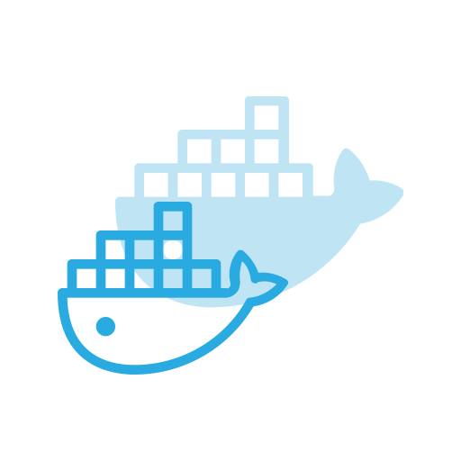
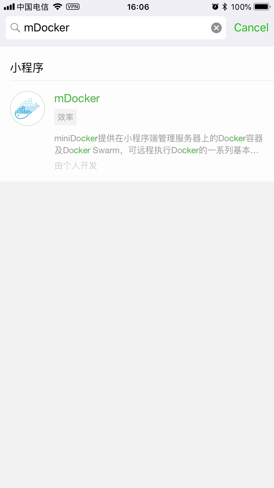
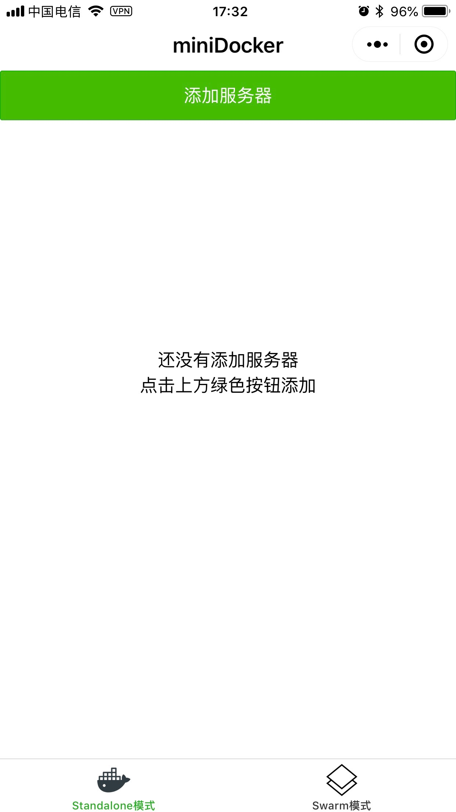
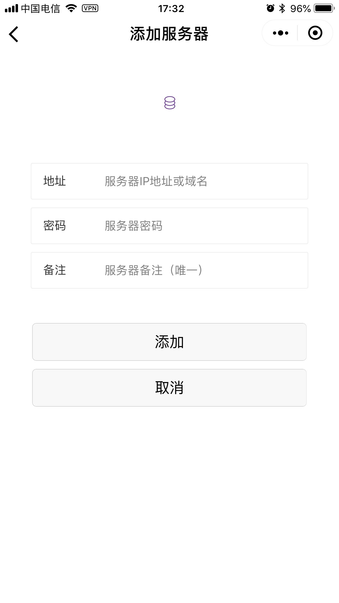
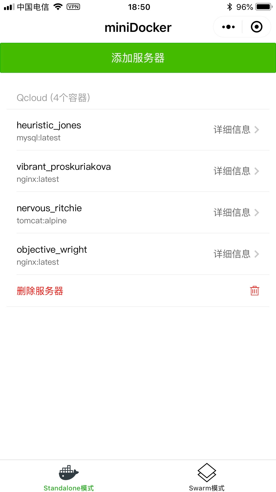

## miniDocker

## 简介

微信小程序*miniDocker*前端UI

相关服务端可见[Repo](https://github.com/WhiteVermouth/miniDocker-server)

## 特色

**miniDocker**提供在小程序端管理服务器上的**Docker**容器及**Docker Swarm**，可远程执行**Docker**的一系列基本操作：

- 启动 `docker start`
- 暂停 `docker pause`
- 停止 `docker stop`
- 删除 `docker rm`
- 读取容器基本信息 `docker ps`
- 查看容器状态 `docker stats`
- 查看容器运行日志信息 `docker logs`

## 注意事项

- **miniDocker**的功能需用户在自己服务器上配置部署好服务端后才可使用。
相关说明可见服务端[Repo](https://github.com/WhiteVermouth/miniDocker-server)

## 安装使用

#### 微信小程序搜索: **mDocker**

## 功能展示

### 初始界面

### 添加服务器

### 服务端容器总揽

### 容器详细信息及操作面板

## TODO

* **Standalone** 模式功能细化
* **Swarm** 模式